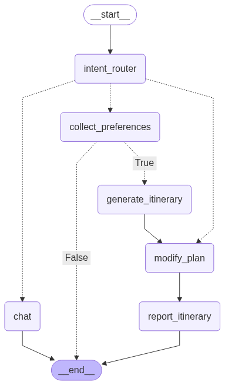

# 智能旅遊助手

## 設計目標
智能旅遊助手旨在提供使用者個人化、自動化、互動式的旅遊規劃體驗。透過 AI 技術結合多種資料來源（景點資訊、天氣、交通、住宿等），幫助使用者從輸入偏好到完成行程安排，全流程地完成旅遊規劃，節省時間並提升決策效率。

# Demo
<video src="Demo.mp4" controls width="640" height="auto"></video>

## 技術棧
前端	Flask, HTML/CSS, JavaScript  
後端	FastAPI, LangGraph, OpenAI API  
資料庫	PostgreSQL  

## 專案結構
project_root/  
│  
├── backend/                          # 後端服務 (FastAPI)  
│   ├── nodes/                        # LangGraph 節點處理邏輯  
│   │   ├── chat.py                   # 處理聊天節點  
│   │   ├── intent_router.py          # 意圖識別與路由節點  
│   │   ├── modify.py                 # 修改行程相關邏輯  
│   │   ├── planner.py                # 行程規劃主邏輯  
│   │   ├── preference.py             # 使用者偏好解析  
│   │   ├── report.py                 # 最終報告生成  
│   │   └── tools.py                  # 工具節點 (API或外部工具調用)  
│   │  
│   ├── routers/                      # FastAPI 路由  
│   │   └── travel_api.py             # 行程 API 路由入口  
│   │  
│   ├── services/                     # 商業邏輯層  
│   │   └── planning_service.py       # 行程計算與組裝邏輯  
│   │  
│   ├── config.py                     # 系統配置與環境變數  
│   ├── database.py                   # 資料庫連線設定  
│   ├── Dockerfile                    # 後端 Docker 設定  
│   ├── graph.py                      # LangGraph 流程定義  
│   ├── main.py                       # FastAPI 主入口點  
│   ├── models.py                     # Pydantic 資料驗證模型  
│   ├── prompts.py                    # 提示詞定義  
│   ├── requirements.txt              # 後端依賴套件  
│   └── schema.py                     # SQLAlchemy 資料模型  
│  
├── frontend/                         # 前端服務 (Flask)  
│   ├── blueprints/                   # Flask 藍圖 (模組化路由)  
│   │   ├── settings.py               # 設定頁面藍圖  
│   │   └── travel_plan.py            # 行程規劃頁面藍圖  
│   │  
│   ├── static/                       # 靜態資源  
│   │   ├── css/                      # CSS 檔案  
│   │   ├── js/                       # JS 檔案  
│   │   └── images/                   # 圖片資源（目前為空）  
│   │  
│   ├── templates/                    # HTML 樣板  
│   │   ├── base.html                 # 基礎樣板  
│   │   ├── itinerary_planning.html   # 行程規劃頁面  
│   │   ├── plan.html                 # 行程預覽頁面  
│   │   ├── settings.html             # 設定頁面  
│   │   └── travel_plan.html          # 旅遊助手頁面  
│   │  
│   ├── app.py                        # Flask 主入口點  
│   ├── Dockerfile                    # 前端 Docker 設定  
│   └── requirements.txt              # 前端依賴套件  

## Agent 工作流


## 運行方式
```bash
docker-compose up -d --build
```
**記得修改 .env 的 OPENAI_API_KEY**
